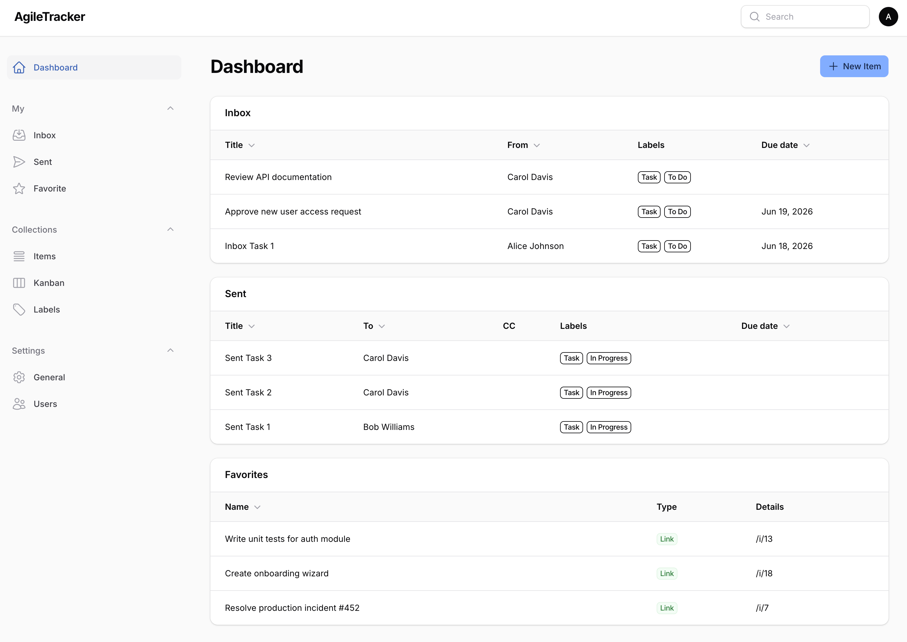

# AgileTracker

A minimal project & task manager built with **Laravel & Filament PHP**. Jira/Redmine-alternative.



## Stack

- PHP 8.3+
- Laravel 11
- FilamentPHP 3
- Spatie Laravel Permission (roles)
- Spatie Laravel Activitylog (change history)
- Tailwind CSS (via Filament)
- SQLite / MySQL / PostgreSQL

---

## Local development

See [docs/wiki/development.md](docs/wiki/development.md).

---

## AI Agent Configuration (`.agents/`)

This project follows the [.agents Protocol](https://dotagentsprotocol.com/) — an open standard for AI agent configuration. Everything an AI coding agent needs lives in one vendor-neutral directory:

```
.agents/
├── agents.md              # project guidelines (AGENTS.md compatible)
├── system-prompt.md       # system prompt for AI assistants
├── mcp.json               # MCP server configuration
├── models.json            # model presets & provider keys
├── settings.json          # general settings
├── layouts/ui.json        # UI/layout preferences
├── skills/                # codified procedural knowledge
│   ├── laravel-filament-dev/
│   ├── code-review/
│   └── schema-design/
├── agents/                # sub-agent profiles
│   ├── backend-dev/
│   ├── code-reviewer/
│   └── frontend-dev/
├── tasks/                 # scheduled repeat tasks
│   ├── daily-review/
│   └── weekly-cleanup/
└── memories/              # persistent memory across sessions
    ├── architecture.md
    ├── schema.md
    └── conventions.md
```

### Available Sub-Agents

| Agent | Role | Description |
|-------|------|-------------|
| `backend-dev` | Backend Developer | Laravel/PHP backend specialist |
| `code-reviewer` | Code Reviewer | Security, performance, code quality |
| `frontend-dev` | Frontend Developer | Tailwind CSS & Filament UI |

### Skills

| Skill | Description |
|-------|-------------|
| `laravel-filament-dev` | Build features using Laravel 11 + FilamentPHP 3 |
| `code-review` | Review code for quality, security, and performance |
| `schema-design` | Design and review database schemas |

The `.agents/` directory is **version-controlled** — commit it to share agent config with the team.

---

## File structure (this scaffold)

```
app/
  Filament/
    Pages/
      KanbanBoard.php           ← Drag-and-drop Kanban view
    Resources/
      ItemResource.php          ← Main resource (Tasks / Epics / Projects)
      ItemResource/
        Pages/
          ListItems.php         ← Tabbed list (All / Mine / To Do / In Progress / Overdue)
          CreateItem.php
          EditItem.php
        RelationManagers/
          CommentsRelationManager.php   ← Inline comments with @mention support
          ChildrenRelationManager.php   ← Sub-items panel
      LabelResource.php
      UserResource.php
    Widgets/
      StatsOverviewWidget.php   ← Dashboard stats (open, in-progress, done today, overdue)
      MyTasksWidget.php         ← Current user's open tasks

  Models/
    Item.php      ← Single table (type column: task / epic / project / case)
    Label.php
    Comment.php
    User.php

  Providers/
    Filament/
      AdminPanelProvider.php

database/
  migrations/
    ..._create_items_table.php
    ..._create_labels_table.php
    ..._create_comments_table.php
    ..._create_statuses_table.php
  seeders/
    RolesAndPermissionsSeeder.php   ← admin / manager / member roles + default admin user

resources/
  views/
    filament/
      pages/
        kanban-board.blade.php  ← Blade + Alpine.js drag-and-drop Kanban
```

---

## Key design decisions

| Decision | Reason |
|---|---|
| Single `items` table with `type` column | Simpler than full polymorphism; easy to convert between types |
| `parent_id` self-reference | Builds Project → Epic → Task hierarchy with one join |
| FilamentPHP v3 Resources | Handles CRUD, filters, relations, global search with minimal boilerplate |
| HTML5 drag events + Livewire | No extra JS library; status changes persist via `#[On('item-moved')]` |
| Spatie Permission | Role-gated panel access; expandable to per-resource policies |

---

## Roles

| Role | Permissions |
|---|---|
| **admin** | All permissions + manage users |
| **manager** | View, create, edit items + manage labels |
| **member** | View, create, edit items |
