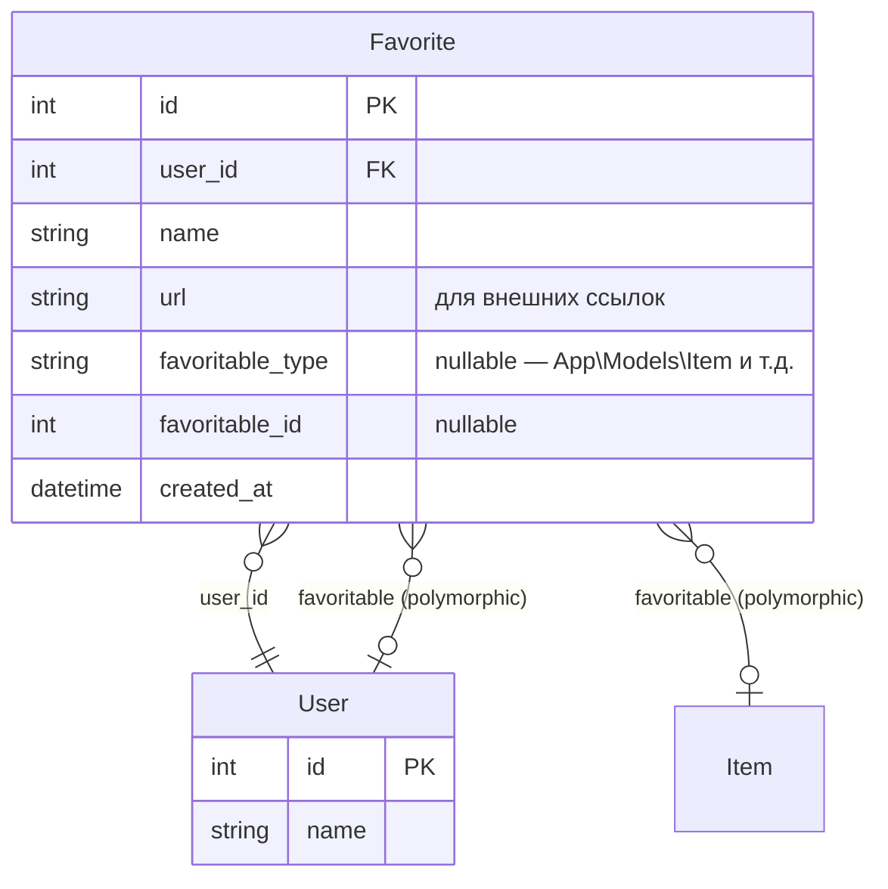

# RFC: Favorite — избранное (полиморфные закладки)

## TL;DR

Создать модель `Favorite` с полиморфной связью через MorphTo. Пользователь может добавлять в избранное как внешние ссылки, так и любые объекты системы: Items, Users, и др.

---

## Context

### What?

Модель `Favorite` — элемент избранного (закладка).

Два варианта:

1. **Внешняя ссылка** — произвольный URL + заголовок (не привязана к системному объекту)
2. **Закладка на объект** — ссылка на Item, User или другой favoritable-объект в системе

Модель и вьюхи должны учитывать оба варианта. Полиморфная связь `favoritable` позволяет добавлять в избранное любые модели без изменения их схемы.

Страница **Favorite** в навигации (группа My) — показывает все закладки текущего пользователя.

### Why?

Нужен единый механизм «избранного»:
- Закрепить важные задачи/проекты для быстрого доступа
- Сохранить внешнюю ссылку (документацию, референс) прямо в системе
- Полиморфная схема позволяет в будущем добавлять закладки на любые сущности без миграций

### How?

1. **Миграция** — таблица `favorites`
2. **Модель `Favorite`** — `MorphTo` на `favoritable`, `BelongsTo` на `user`
3. **Страница Favorite** — кастомная страница со списком избранного (таблица + ссылки на оригинальные объекты)
4. **Трейт `Favoritable`** — для моделей, которые можно добавлять в избранное

---

## Components & Specifics

### Модель данных



### Миграция: `favorites`

```
favorites:
  id                  bigint PK
  user_id             foreignId → users.id, cascade
  name                string     — название закладки
  url                 string nullable — внешняя ссылка
  favoritable_type    string nullable — morph type
  favoritable_id      bigint nullable  — morph id
  created_at          timestamp
```

### Модель Favorite

```php
class Favorite extends Model
{
    protected $fillable = ['user_id', 'name', 'url', 'favoritable_type', 'favoritable_id'];

    public function user(): BelongsTo;
    public function favoritable(): MorphTo;
}
```

### Трейт Favoritable

```php
trait Favoritable
{
    public function favorites(): MorphMany
    {
        return $this->morphMany(Favorite::class, 'favoritable');
    }
}
```

Подключается к `Item`, `User` — любым моделям, которые хотим добавлять в избранное.

### Валидация

- Если `url` заполнен → внешняя ссылка, `favoritable_*` = null
- Если `favoritable_type` заполнен → закладка на объект, `url` = null
- `name` — обязательное (можно авто-заполнить из `favoritable` title/name или из `url`)

### Страница Favorite

Кастомная Filament Page в группе My (sort = 3). Показывает таблицу избранного:

| Колонка | Источник |
|---------|----------|
| Name    | `favorite.name` |
| Type    | badge: «Link» / «Item» / «User» |
| Details | кликабельная: внешняя ссылка или ссылка на favoritable-объект |

Добавление в избранное — через Action на странице Favorite (форма с выбором типа: внешняя ссылка или внутренний объект).

### Out of scope

- «Звёздочка» на странице задачи для быстрого добавления в избранное (будет позже)
- Сортировка/группировка закладок
- Иконки для закладок (favicon внешних ссылок)

### Constraints

- Закладка всегда принадлежит одному пользователю
- `url` и `favoritable` — взаимоисключающие (валидация)
- Один пользователь может добавить один и тот же объект только один раз (уникальность по `user_id + favoritable_type + favoritable_id`)

---

## Acceptance Criteria

- [ ] Миграция: таблица `favorites` создана
- [ ] Модель `Favorite` с `MorphTo` (favoritable) и `BelongsTo User`
- [ ] Трейт `Favoritable` работает с `Item` и `User`
- [ ] Страница Favorite показывает избранное текущего пользователя
- [ ] Action «Add to favorites» на странице Favorite (форма: внешняя ссылка ИЛИ внутренний объект)
- [ ] Валидация: url XOR favoritable
- [ ] Навигация: Favorite в группе My (sort = 3)
- [ ] `./vendor/bin/pint` — passes
- [ ] `php artisan test` — passes

---

## Addenda

### Пример использования

```
Favorite:
  name: "AgileTracker Core"   → favoritable = Item #1
  name: "React docs"          → url = "https://react.dev"
  name: "Alice Johnson"       → favoritable = User #2
```

### План

1. Миграция + модель + трейт
2. Страница Favorite (таблица избранного + Action для добавления)
3. Подключить Favoritable к Item и User
