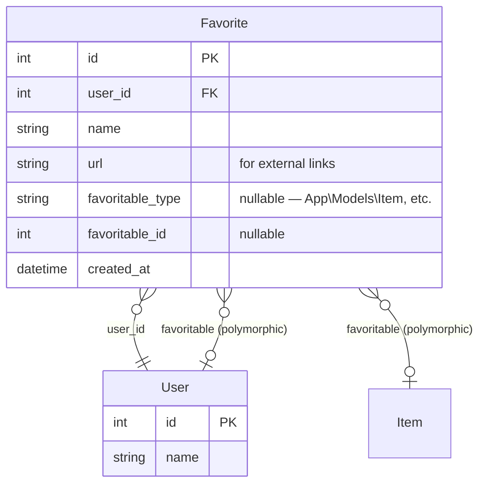

# RFC: Favorite — polymorphic bookmarks


## TL;DR

Create a `Favorite` model with a polymorphic relationship via MorphTo. Users can bookmark both external links and any system objects: Items, Users, and more.

---

## Context

### What?

`Favorite` model — a bookmark / saved item.

Two variants:

1. **External link** — an arbitrary URL + title (not linked to any system object)
2. **Object bookmark** — a reference to an Item, User, or other favoritable object in the system

Both variants must be handled by the model and views. The polymorphic `favoritable` relationship allows bookmarking any model without changing its schema.

**Favorite** page in navigation (My group) — shows all bookmarks for the current user.

### Why?

A unified "bookmarks" mechanism is needed:
- Pin important tasks/projects for quick access
- Save an external link (documentation, reference) directly in the system
- The polymorphic schema allows adding bookmarks to any entity in the future without migrations

### How?

1. **Migration** — `favorites` table
2. **`Favorite` model** — `MorphTo` on `favoritable`, `BelongsTo` on `user`
3. **Favorite page** — custom page with a list of bookmarks (table + links to original objects)
4. **`Favoritable` trait** — for models that can be bookmarked

---

## Components & Specifics

### Data model



### Migration: `favorites`

```
favorites:
  id                  bigint PK
  user_id             foreignId → users.id, cascade
  name                string     — bookmark label
  url                 string nullable — external link
  favoritable_type    string nullable — morph type
  favoritable_id      bigint nullable  — morph id
  created_at          timestamp
```

### Favorite model

```php
class Favorite extends Model
{
    protected $fillable = ['user_id', 'name', 'url', 'favoritable_type', 'favoritable_id'];

    public function user(): BelongsTo;
    public function favoritable(): MorphTo;
}
```

### Favoritable trait

```php
trait Favoritable
{
    public function favorites(): MorphMany
    {
        return $this->morphMany(Favorite::class, 'favoritable');
    }
}
```

Attached to `Item`, `User` — any models we want to make bookmarkable.

### Validation

- If `url` is filled → external link, `favoritable_*` = null
- If `favoritable_type` is filled → bookmark on an object, `url` = null
- `name` — required (can be auto-filled from `favoritable` title/name or from `url`)

### Favorite page

Custom Filament Page in the My group (sort = 3). Shows a table of bookmarks:

| Column  | Source |
|---------|--------|
| Name    | `favorite.name` |
| Type    | badge: «Link» / «Item» / «User» |
| Details | clickable: external link or link to favoritable object |

Adding to favorites — via an Action on the Favorite page (form with type selection: external link or internal object).

### Out of scope

- «Star» on the task page for quick bookmarking (later)
- Bookmark sorting/grouping
- Bookmark icons (favicons for external links)

### Constraints

- A bookmark always belongs to one user
- `url` and `favoritable` — mutually exclusive (validation)
- A user can bookmark the same object only once (uniqueness on `user_id + favoritable_type + favoritable_id`)

---

## Acceptance Criteria

- [ ] Migration: `favorites` table created
- [ ] `Favorite` model with `MorphTo` (favoritable) and `BelongsTo User`
- [ ] `Favoritable` trait works with `Item` and `User`
- [ ] Favorite page shows the current user's bookmarks
- [ ] «Add to favorites» Action on the Favorite page (form: external link OR internal object)
- [ ] Validation: url XOR favoritable
- [ ] Navigation: Favorite in My group (sort = 3)
- [ ] `./vendor/bin/pint` — passes
- [ ] `php artisan test` — passes

---

## Addenda

### Usage example

```
Favorite:
  name: "AgileTracker Core"   → favoritable = Item #1
  name: "React docs"          → url = "https://react.dev"
  name: "Alice Johnson"       → favoritable = User #2
```

### Plan

1. Migration + model + trait
2. Favorite page (bookmarks table + Action to add)
3. Attach Favoritable to Item and User
