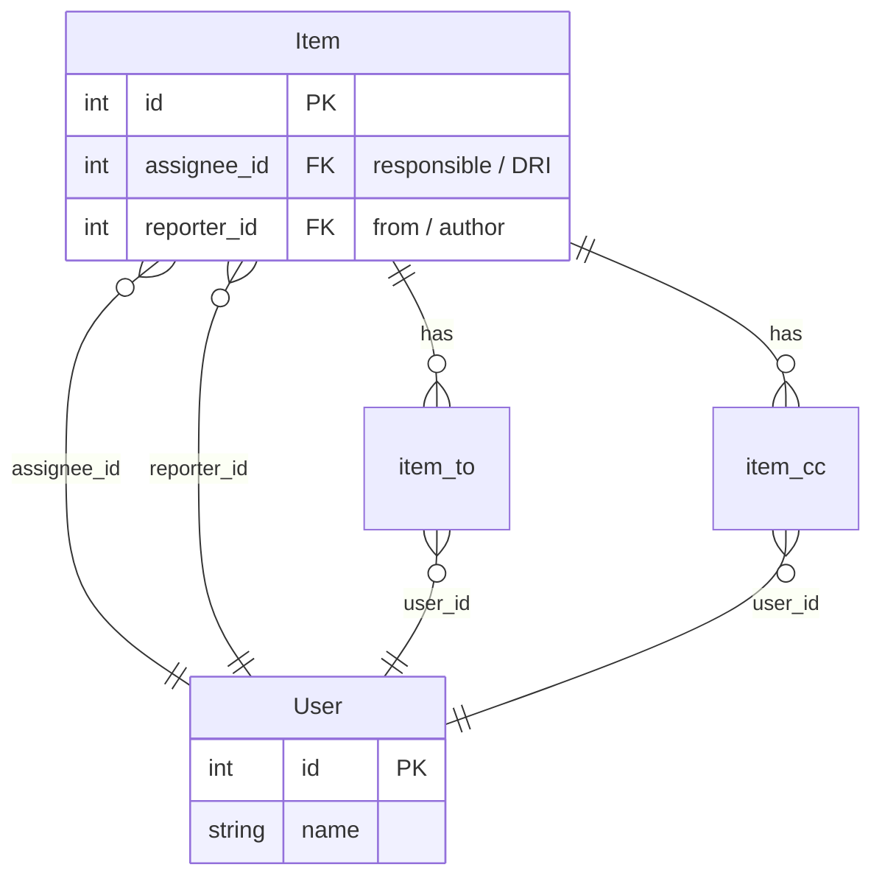

# RFC: Participants — extending the Item model

## TL;DR

Add `to` (recipients, multiple — BelongsToMany) and `cc` (observers) fields to `Item`. `from` and `responsible` already exist (`reporter_id` and `assignee_id`). Update Inbox. Group all participant fields into a «Participants» section; hide empty fields on view.

---

## Context

### What?

Add to the `Item` model:

- `to` — who the task is addressed to (**BelongsToMany**, pivot `item_to`). Can be empty (0+ recipients). Currently the «to» role is partially filled by `assignee_id`, but semantically they are different: `to` — addressee(s), `assignee` — responsible/DRI.
- `cc` — observers (BelongsToMany, pivot `item_cc`)

**Already exists:**
- `from` = `reporter_id` (BelongsTo) — always 1, the person who created the task
- `responsible` = `assignee_id` (BelongsTo) — always 1, DRI / executor

**Semantics:**
| Role | Relation | Multiplicity | Description |
|------|----------|--------------|-------------|
| from | `reporter()` BelongsTo | 1 | Task author |
| responsible | `assignee()` BelongsTo | 1 | DRI / executor |
| to | `to()` BelongsToMany | 0+ | Participants — who the task is addressed to |
| cc | `cc()` BelongsToMany | 0+ | Observers

**Views:**
- **Inbox** — items where I am in `to` — already built, currently filters by `assignee_id`
- **Sent** — items where I am in `from` (`reporter_id = auth()->id()`) — already built

**Display (View vs Edit):**
- All participant fields are grouped in a **«Participants» section** (Section)
- On **view**: if a field is empty — hide it (`.visible(fn ($state) => ...)`)
- On **edit**: all fields are always shown — can be filled in / changed

### Why?

Currently `Item` only supports `assignee_id` (executor) and `reporter_id` (author). This is insufficient:

- Need to keep people in copy — they are not executors, but should be in the loop (cc)
- Need to explicitly separate «who the task is addressed to» (to) and «who is responsible for execution» (responsible)
- `to` is a set of recipients, not a single one (like in email)

This extension provides «email-like» semantics for task participants.

### How?

1. **Migrations** — pivot `item_to`, `item_cc`
2. **`Item` model** — new relations `to()`, `cc()`
3. **Inbox update** — filter by pivot `item_to` (instead of `assignee_id`)
4. **`ItemResource`** — form and infolist: «Participants» section, empty fields hidden on view

---

## Components & Specifics

### Data model



### Migrations

The `to_id` field in items is **not created** — `to` is a BelongsToMany via pivot.

**1: `item_to`** — who the task is addressed to
- `item_id` — FK → `items.id`, cascade
- `user_id` — FK → `users.id`, cascade
- unique(`item_id`, `user_id`)

**2: `item_cc`** — observers
- `item_id` — FK → `items.id`, cascade
- `user_id` — FK → `users.id`, cascade
- unique(`item_id`, `user_id`)

### Relations in the Item model

```php
// Already exists
public function assignee(): BelongsTo   // responsible / DRI
public function reporter(): BelongsTo   // from

// New
public function to(): BelongsToMany           // recipients (set)
public function cc(): BelongsToMany           // observers
```

### «Participants» section — View vs Edit

**Edit (form):**
- All fields always shown, even if empty — user can fill them in
- Fields inside `Section::make('Participants')`:
  - `reporter_id` → disabled (auto-filled on create)
  - `assignee_id` → Select, searchable by users
  - `to` → Select, multiple, searchable by users
  - `cc` → Select, multiple, searchable by users

**View (infolist):**
- All fields inside `Section::make('Participants')`
- Each field: `.visible(fn ($state) => !empty($state))` — hide if no value
- `reporter` → TextEntry with user name
- `assignee` → TextEntry with user name
- `to` → TextEntry, comma-separated list of names
- `cc` → TextEntry, comma-separated list of names

### Pages

| Page | Filter | Group |
|------|--------|-------|
| Inbox    | user in pivot `item_to` | My |
| Sent     | `reporter_id = auth()->id()` | My |
| Favorite | stub (1=0) | My |

### Navigation order

```
My                (top)
  Inbox           1
  Sent            2
  Favorite        3
Collections
  Items           1
  Kanban          2
Settings
  Users           9
  Labels          10
```

### Out of scope

- Notifications when added to to/cc
- Favorite / bookmarks (separate RFC)
- Drag-and-drop participant assignment

### Constraints

- `to` — BelongsToMany, 0+ recipients (can be empty)
- `cc` — BelongsToMany, 0+ observers (can be empty)
- `responsible` (`assignee_id`) — always 1 (BelongsTo)
- `from` (`reporter_id`) — always 1 (BelongsTo), non-editable

---

## Acceptance Criteria

- [ ] Migration: `item_to` table created (pivot for BelongsToMany `to`)
- [ ] Migration: `item_cc` table created
- [ ] Model `Item`: relations `to()`, `cc()` working (BelongsToMany)
- [ ] Model `Item`: `$fillable` updated for `to`, `cc`
- [ ] Inbox: filter changed to pivot `item_to` (instead of `assignee_id`)
- [ ] `ItemResource` (form): «Participants» section includes `reporter_id` (disabled), `assignee_id`, `to` (multiple), `cc` (multiple)
- [ ] `ItemResource` (infolist): «Participants» section, empty fields hidden (`.visible()`)
- [ ] Infolist: `to`, `cc` — displayed as comma-separated list of names
- [ ] `./vendor/bin/pint` — passes
- [ ] `php artisan test` — passes
